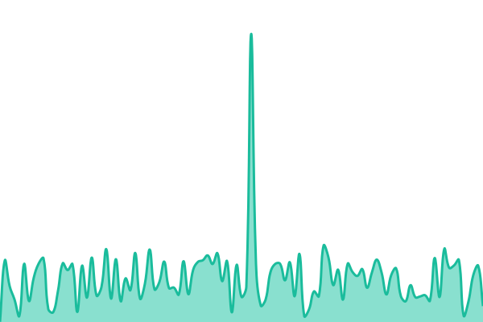
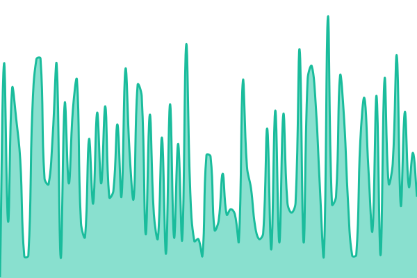
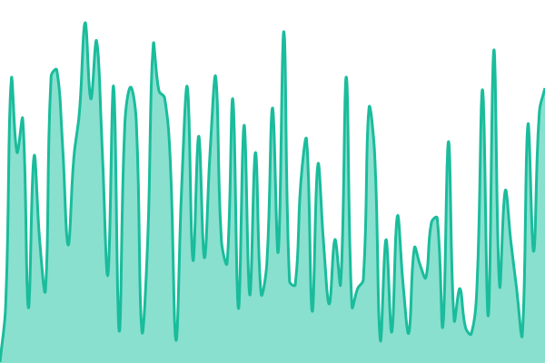
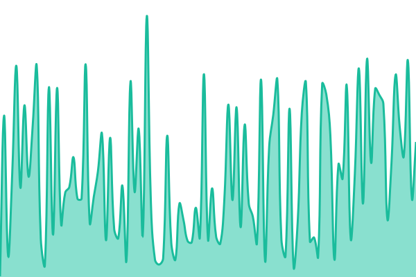
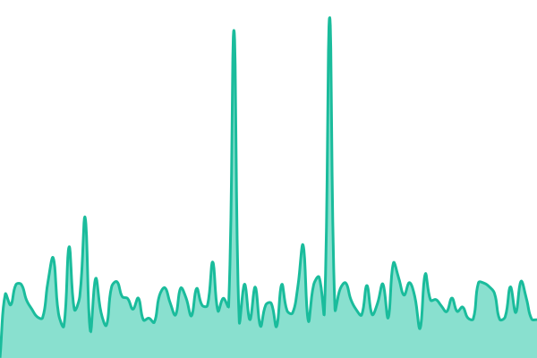

# [📈 Live Status](https://status.datariesgos.com): <!--live status--> **🟩 All systems operational**

This repository contains the open-source uptime monitor and status page for [Data Innova](www.datainnova.co), powered by [Upptime](https://github.com/upptime/upptime).

With [Upptime](https://upptime.js.org), you can get your own unlimited and free uptime monitor and status page, powered entirely by a GitHub repository. We use [Issues](https://github.com/Data-Innova/monitoreo-datariesgos/issues) as incident reports, [Actions](https://github.com/Data-Innova/monitoreo-datariesgos/actions) as uptime monitors, and [Pages](https://status.datariesgos.com) for the status page.

<!--start: status pages-->
<!-- This summary is generated by Upptime (https://github.com/upptime/upptime) -->
<!-- Do not edit this manually, your changes will be overwritten -->
<!-- prettier-ignore -->
| URL | Status | History | Response Time | Uptime |
| --- | ------ | ------- | ------------- | ------ |
|  [Datariesgos - Back Web](https://app.datariesgos.com/validador/apiPublica/healthChecks) | 🟩 Up | [datariesgos-back-web.yml](https://github.com/Data-Innova/monitoreo-datariesgos/commits/HEAD/history/datariesgos-back-web.yml) | 

 205ms
     
 | 

<a href="https://status.datariesgos.com/history/datariesgos-back-web">100.00%</a>
    

|  [Datariesgos - Batch](https://app.datariesgos.com/validador/healthBatch/healthChecks/health) | 🟩 Up | [datariesgos-batch.yml](https://github.com/Data-Innova/monitoreo-datariesgos/commits/HEAD/history/datariesgos-batch.yml) | 

 172ms
     
 | 

<a href="https://status.datariesgos.com/history/datariesgos-batch">100.00%</a>
    

|  [Datariesgos - Batch Caller](https://app.datariesgos.com/validador/healthBatchCaller/healthChecks/health) | 🟩 Up | [datariesgos-batch-caller.yml](https://github.com/Data-Innova/monitoreo-datariesgos/commits/HEAD/history/datariesgos-batch-caller.yml) | 

 174ms
     
 | 

<a href="https://status.datariesgos.com/history/datariesgos-batch-caller">100.00%</a>
    

|  [Datariesgos - WebService](https://app.datariesgos.com/validador/healthWs/healthChecks) | 🟩 Up | [datariesgos-web-service.yml](https://github.com/Data-Innova/monitoreo-datariesgos/commits/HEAD/history/datariesgos-web-service.yml) | 

 168ms
     
 | 

<a href="https://status.datariesgos.com/history/datariesgos-web-service">100.00%</a>
    

|  [Datariesgos - Front Web](https://validador.datariesgos.com/) | 🟩 Up | [datariesgos-front-web.yml](https://github.com/Data-Innova/monitoreo-datariesgos/commits/HEAD/history/datariesgos-front-web.yml) | 

 248ms
     
 | 

<a href="https://status.datariesgos.com/history/datariesgos-front-web">100.00%</a>
    

|  [Datariesgos - Pagina Web](https://datariesgos.com/) | 🟩 Up | [datariesgos-pagina-web.yml](https://github.com/Data-Innova/monitoreo-datariesgos/commits/HEAD/history/datariesgos-pagina-web.yml) | 

 557ms
     
 | 

<a href="https://status.datariesgos.com/history/datariesgos-pagina-web">100.00%</a>
    

<!--end: status pages-->

[**Visit our status website →**](https://status.datariesgos.com)

## 📄 License

- Powered by: [Upptime](https://github.com/upptime/upptime)
- Code: [MIT](./LICENSE) © [Anand Chowdhary](https://anandchowdhary.com), supported by [Pabio](https://pabio.com)
- Data in the `./history` directory: [Open Database License](https://opendatacommons.org/licenses/odbl/1-0/)
